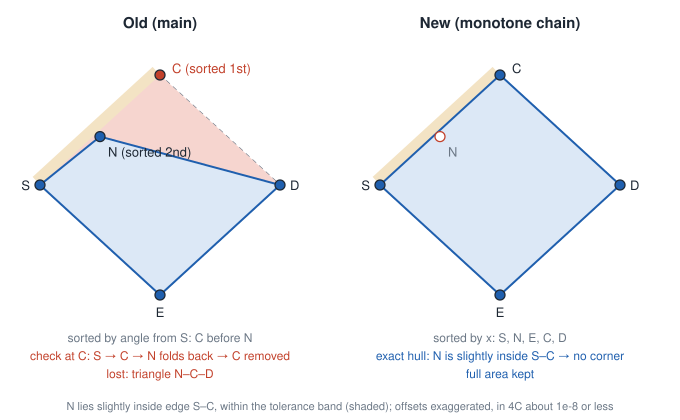
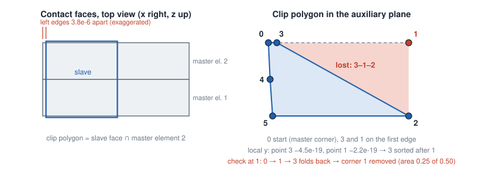

# 3D mortar: clip polygons can lose a corner

## Summary

The convex hull routine that builds the clip polygon of a slave and a master element,
`Mortar::sort_convex_hull_points()`, can drop a real corner of the polygon when candidate points
are nearly collinear. The clip polygon then misses part of the overlap, so the mortar integrals are
wrong by the area of the lost piece. Whether it happens depends on round-off, so it can switch on
and off between Newton iterations. This shows up as wrong results (in an existing test, up to 25 %
of a clip polygon is lost) and as Newton iterations that cycle and do not converge.

## Where the clip polygon is built

`Mortar::Coupling3d::evaluate_coupling()` computes the overlap of a slave and a master element:

1. Project both elements onto the auxiliary plane.
2. `polygon_clipping_convex_hull()` collects candidate points: slave corners inside the master,
   master corners inside the slave, and intersections of slave and master edges. Points closer
   than `tol` are merged (`tol = MORTARCLIPTOL * smallest edge length = 1e-8 * h_min`).
3. `Mortar::sort_convex_hull_points()` takes the convex hull of the candidates as the clip polygon
   (the overlap of two convex polygons is convex). The points are given in a local 2D frame of
   the auxiliary plane, whose x-axis runs from the first to the second candidate.
4. Triangulate the polygon and integrate on the triangles.

The volume mortar coupling (`Coupling::VolMortar`) uses the same routine.

## Current algorithm and when it fails

1. Start at the candidate S with the smallest local x.
2. Sort the other candidates by their angle from S. Only exactly equal angles are tie-broken.
3. Walk through the sorted list once. Keep a point if the cross product of the edges to the last
   kept point and to the next point in the list is `<= -tol` (clockwise), otherwise remove it as
   collinear. Decisions are never revisited.

This fails if a candidate N lies almost on the **first** edge S–C of the polygon, slightly towards
the inside. Its angle from S is then marginally smaller than that of the far corner C, so N is
sorted after C. The check at C runs S → C → N, which folds back on itself, so the cross product is
about zero and the real corner C is removed. The triangle N–C–D is missing from the clip polygon.



Points slightly outside the first edge, near the closing edge, or clearly off an edge are handled
correctly. Which edge is the first one depends on the local frame, which is fixed by the first two
candidates, so whether a configuration is affected is arbitrary from a physical point of view.

### Where nearly collinear candidates come from

- **Nearly coincident slave and master edges**, e.g. a body pressed onto another one with flush
  side faces, or a symmetry plane along element boundaries. If the edges cross at a tiny angle, an
  intersection point is created somewhere along them, and round-off from the deformation and the
  projection decides whether it lies a hair inside or outside.
- **T-junctions in non-matching meshes**: a corner of one element lies almost on an edge of the
  other.
- **Sliding interfaces**, where nodes of one side pass across edges of the other.

## Consequences

### Wrong clip polygons in existing tests

`clip_polygon_corner_diagnostic.patch` (apply on main) computes the exact convex hull in addition
and prints `CLIP POLYGON CORNER DROPPED: ...` whenever the clip polygon lost more area than the
removal of almost straight points can explain (see the comments in the patch). On main it reports:

| Test | Reports | Largest loss |
|---|---|---|
| `fsi_ves_mono_mtrss_ost_ost_slidrot` | 10 | 25.1 % of a clip polygon |
| `contact3D_clip_polygon_coincident_edges_three_hex8` (new reproducer, see below) | 3 | 49.9 % |
| hex27 contact, tet4 elch/sti mortar, f3 meshtying, FSI contact tests | 0 | |

### Newton iterations cycle and do not converge

This is how the bug was found: a non-matching TSI box-on-box mesh (lower 7×2×2, upper 5×3×2 HEX8)
failed in steps 7 to 11. The reproducer `contact3D_clip_polygon_coincident_edges_three_hex8`
shows the same mechanism with three HEX8 elements: a soft cube (slave) is pressed with Coulomb
friction onto a stiff box (master) of two elements, and the left edges of both bodies stay only
3.8e-6 apart. The clip polygon of the slave face with the upper master element has three
candidates on its first edge, and only round-off (local y of -4.5e-19 versus -2.2e-19) decides
their order.



Whether round-off puts the point on the bad side changes with the iterate. On main (2 ranks, as
in the test), Newton in step 1 has practically converged three times, then the corner is
dropped, half of the clip polygon is lost, and the residual jumps to the same 0.487 each time.
Newton then runs through the same sequence back to the same solution, until `MAXITER`. The active
set does not change from iteration 2 on.

```
it 0:   ||F|| = 3.76551e-02  dx = 0.00000e+00
it 1:   ||F|| = 7.39941e-06  dx = 2.72716e-04
it 2:   ||F|| = 2.27272e-03  dx = 6.49314e-03
it 3:   ||F|| = 8.20042e-05  dx = 1.42655e-03
it 4:   ||F|| = 6.49472e-07  dx = 1.24207e-04
it 5:   ||F|| = 4.86789e-01  dx = 9.54342e-07   <- corner dropped
it 6:   ||F|| = 1.10360e+00  dx = 2.11573e-03
it 7:   ||F|| = 1.45891e-03  dx = 2.12398e-03
it 8:   ||F|| = 1.35680e-06  dx = 1.64810e-04
it 9:   ||F|| = 3.78369e-10  dx = 2.75948e-06
it 10:  ||F|| = 4.86789e-01  dx = 9.43037e-10   <- corner dropped
it 11:  ||F|| = 1.10360e+00  dx = 2.11573e-03
it 12:  ||F|| = 1.45891e-03  dx = 2.12398e-03
it 13:  ||F|| = 1.35680e-06  dx = 1.64810e-04
it 14:  ||F|| = 3.78349e-10  dx = 2.75948e-06
it 15:  ||F|| = 8.92356e-14  dx = 9.43038e-10
it 16:  ||F|| = 4.86789e-01  dx = 7.17943e-16   <- corner dropped
it 17:  ||F|| = 1.10360e+00  dx = 2.11573e-03
it 18:  ||F|| = 1.45891e-03  dx = 2.12398e-03
it 19:  ||F|| = 1.35680e-06  dx = 1.64810e-04
it 20:  ||F|| = 3.78341e-10  dx = 2.75948e-06  (Failed!)

Nonlinear solver did not converge. Aborting since DIVERCONT is set to stop.
```

With the fix, step 1 needs 6 iterations and all other steps 4.

## Fix

The clip polygon is computed in two steps:

1. **Exact convex hull** with Andrew's monotone chain algorithm (a standard O(n log n) convex
   hull algorithm): sort the candidates by x and y, then build the upper and the lower chain,
   keeping only strictly clockwise turns. It uses only the sign of cross products and no
   tolerance, so the order of nearly collinear points does not matter.
2. **Remove almost straight points** from this hull: the point with the smallest cross product of
   its two adjacent edges is removed while that cross product is below `tol` (the same criterion
   as before). Each point is judged against its neighbors on the final hull. If fewer than three
   points remain, there is no clip polygon.

The tolerance is deliberately not used while building the hull, since points could then be
removed based on neighbors that are not part of the final polygon. Removing the straightest point
first keeps real corners of tiny polygons, in which several corners are below the tolerance.

### Result changes

Only the reference values of `fsi_ves_mono_mtrss_ost_ost_slidrot` change (4 values of about 1e-5,
up to 5e-4 relative), which is the test where the diagnostic patch reports dropped corners. All
other tests give the same results as on main. New tests:

- `src/mortar/tests/4C_mortar_utils_test.cpp`: unit tests with constructed point sets, among them
  a point slightly inside the first edge (on main the polygon area is 1.5 instead of 2), a sliver
  from slidrot, and a tiny polygon from the tet4 elch tests.
- `tests/input_files/contact3D_clip_polygon_coincident_edges_three_hex8.4C.yaml`: the reproducer
  above, which does not converge on main.

## Not changed yet: the tolerance criterion

The removal of almost straight points compares a cross product, i.e. an area, with `tol`, which is
a length scaled with the element size. The actual distance threshold is therefore
`tol / |distance between the neighbors|`, which does not match the inside/outside checks of the
clipping, which use `tol` as a distance. On small clip polygons, real corners are removed:

- In the tet4 elch/sti mortar tests (elements of size ~2e-4, `tol` ~ 2e-12, clip polygons ~1e-5
  across), corners up to ~4e4 · `tol` off the edge are removed, losing up to 0.4 % of a polygon.
- In the hex27 contact, f3 meshtying and FSI contact tests, very thin or tiny overlaps are
  discarded entirely.

Dividing the cross product by the distance between the neighbors would make the criterion a
distance, consistent with the clipping. This is not done yet, because it changes results of
`contact3D_pwlin_penalty_hex27_new_struct` (VTK reference), 11 tet4 elch/sti mortar tests
(147 values, median 1e-7, at most 9e-6 relative), `f3_beltrami_8x8_meshtying_ale` (17 values, at
most 2e-7) and `fsi_pw_mono_fs_ga_ga_contact` (1 value, 3e-8). A note in the code marks the place.

## Open points

- A nearly collinear point is kept or removed depending on whether it is just below the tolerance,
  which changes the triangulation and causes small residual jumps (about 1e-8 to 1e-7). They cost
  extra Newton iterations but rarely make a step fail.
- Treating nearly coincident edges as coincident in the intersection step of the clipping would
  avoid many nearly collinear candidates. It cannot replace the hull fix, since T-junctions create
  such candidates without any crossing.
- The ambiguous Delaunay triangulation of cocircular clip polygons is a separate problem (branch
  `fix-mortar-delaunay-cocircular`).
